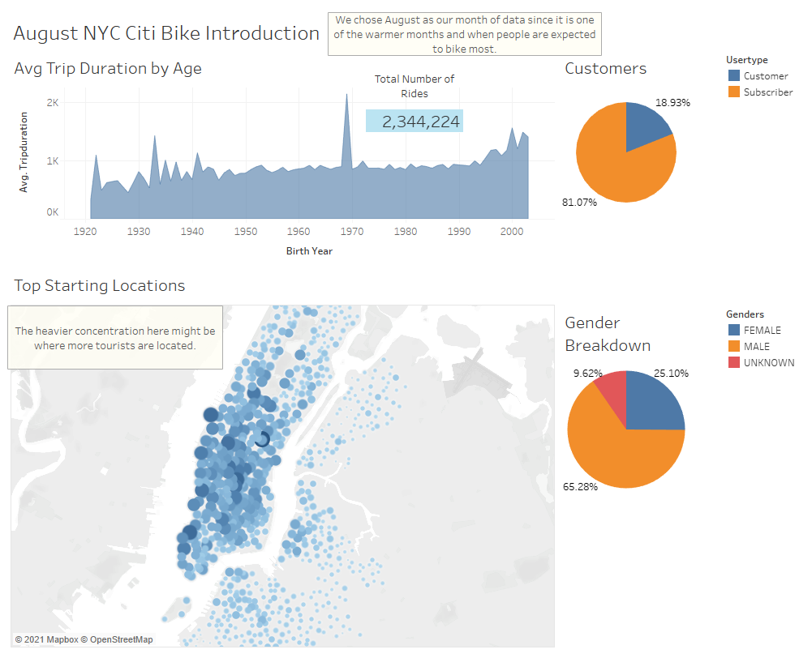
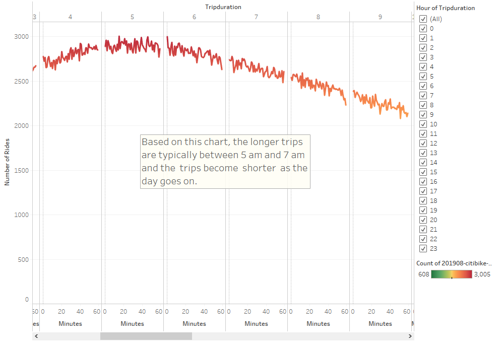
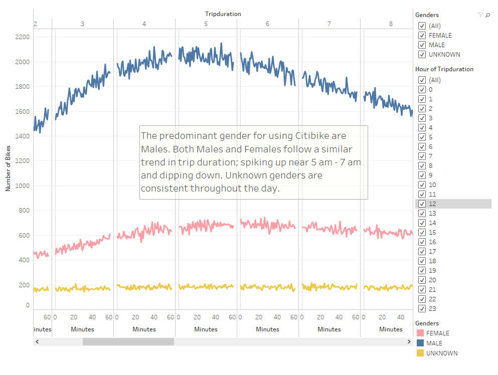
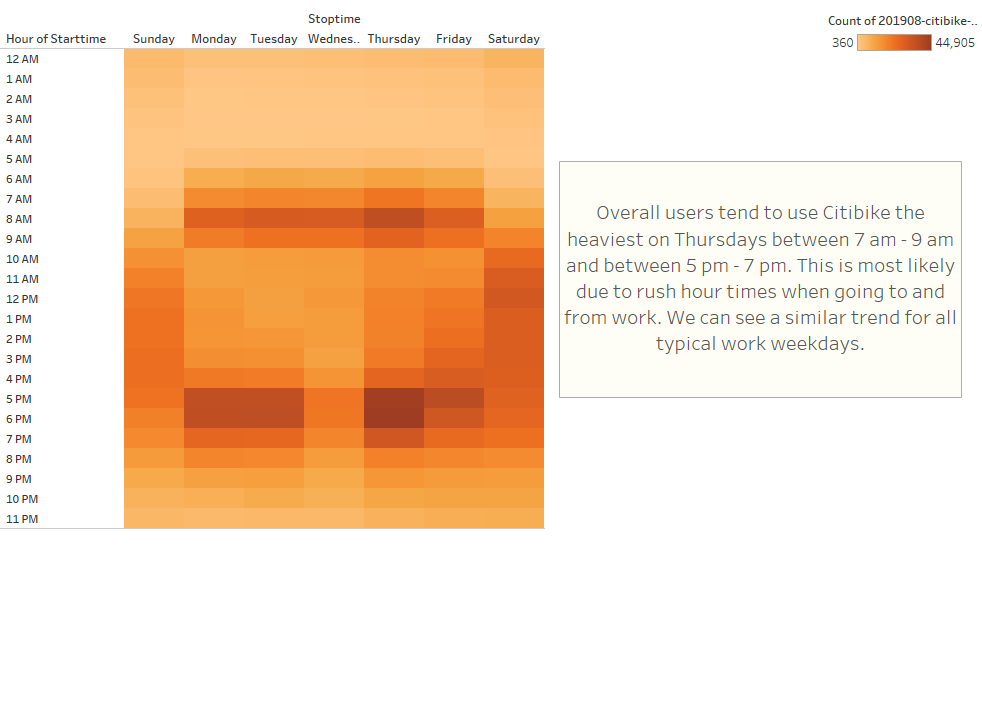
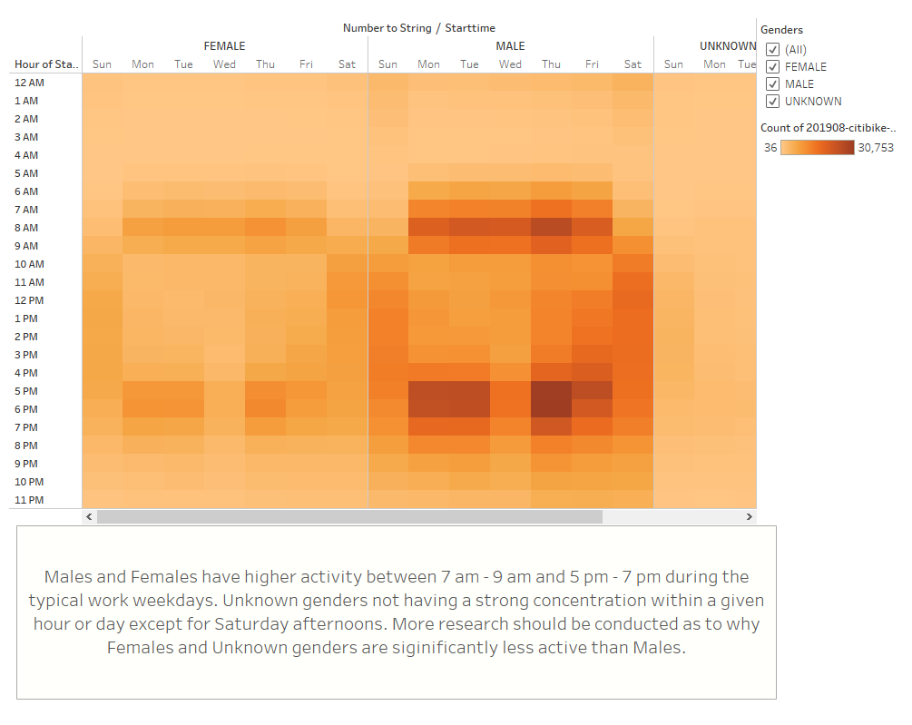
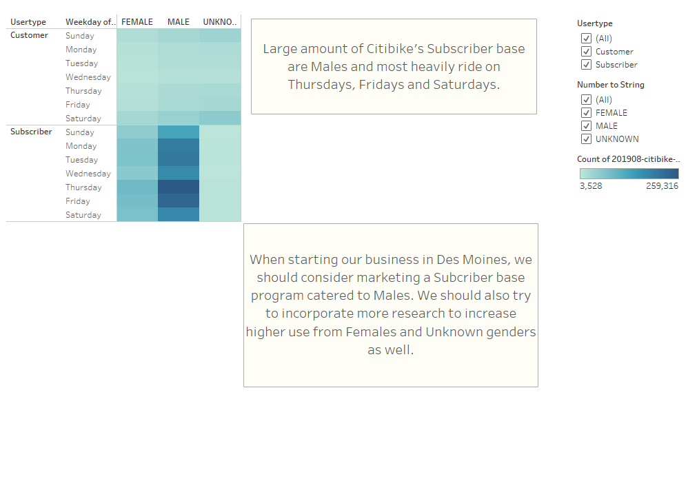

# Overview of the analysis 

The purpose of this analysis is to analyze Citibike NYC's data and look for insights into what we can encounter when running this type of business. These insights will help us in establishing a bikesharing business in the city of Des Moines, Iowa. Using Tableau, we've been able construct several worksheets and dashboards that visualize trends found in the data and organize it all into a story for interactive viewing.

# Results

The follow images and insights are from the Tableau story we created. Feel free to visit the link provided at the end in order to view it in its entirety.

This was a dashboard of some key takeaways from Citibike as a whole. 
- Younger users tend to use Citibike for longer periods of time on average 
- Predominant users are Subscribers
- The Top Starting Locations are heavily concentrated in the borough of Manhattan
- Males tend to use Citibike the most

This chart showcases the number of rides by the hour of the day which helps us decide when we should plan our bike mainentance times.
- 5 am - 7 am have the largest concentration of rides
- The number of rides slowly declines until 1 am where it starts to rise again

Similar to our previous chart, we are now incorporating a Gender breakdown
- Males and Females follow a similar trend as mentioned before
- Unknown genders are fairly consistent throughout the day

This is a heatmap of trips made during each hour of each day of the week
- 7 am - 9 am and 5 pm - 7 pm are typically the heavier times of each day
- Work weekdays typically see large concentrations of use
- Weekends are more evened out in usage throughout the day

Heatmap of Gender breakdown for trips made during each hour of each day of the week
- Males and Females follow a similar time schedule throughout the week with Males being predominant in usage
- Unknown genders are fairly even across the week except for slightly heavier use on Saturdays

Heatmap of Gender vs Usertype usage during days of the week
- Male and Female subscribers have heavier usages on Average 
- Unknown genders have heavier usage as Customers
- Males and Females use Citibike the most on Thursdays, Fridays and Saturdays
- Unknown gender customers focuse more on Weekends

[View the Full Story Here](https://public.tableau.com/profile/frank2753#!/vizhome/bikesharing_NYC_Citibike/NYCStory?publish=yes)

# Summary 

Overall, Citibike NYC in the month of August gave us many insights into what we can expect from a bikesharing business. For one, we would need to establish a subscriber based program that rewards regular users of our bikes. For two, we should map out some of the higher traffic areas in Des Moines so that we know where we should set up more bike stations and bikes. For three, we should plan for bike maintenance during hours of low usage times, typically late nights and during the weekdays.

Some potential opportunities we have are to conduct research into why Males are more predominant than Females in terms of overall users. We can also explore reasons for why Unknown genders (or Other gender to be more politically correct) ride their bikes and see if we can market toward LGBT users. We can also conduct research into reasons why users ride bikes in general, is it for business, pleasure or just needing it to get around in such a dense city. Lastly, we should also conduct a year wide analysis so that we know which months are the heaviest vs the lightest.  

## Extra Visualizations 

If I were to add more visualizations, I would add the following:

1. Trips by Gender by Age breakdown

It would be nice to combine Genders with Age so we can concisely communicate what target demographic uses these bikes. Being able to say "Males between 20 - 40 years old use Citibike" can really help with marketing our business.

2. Bike Utilization chart

Being able to know which bikes are being used the most can help us determine which ones are most likely in need of repairs. Starting the business is one matter but maintaining it is another as well.

